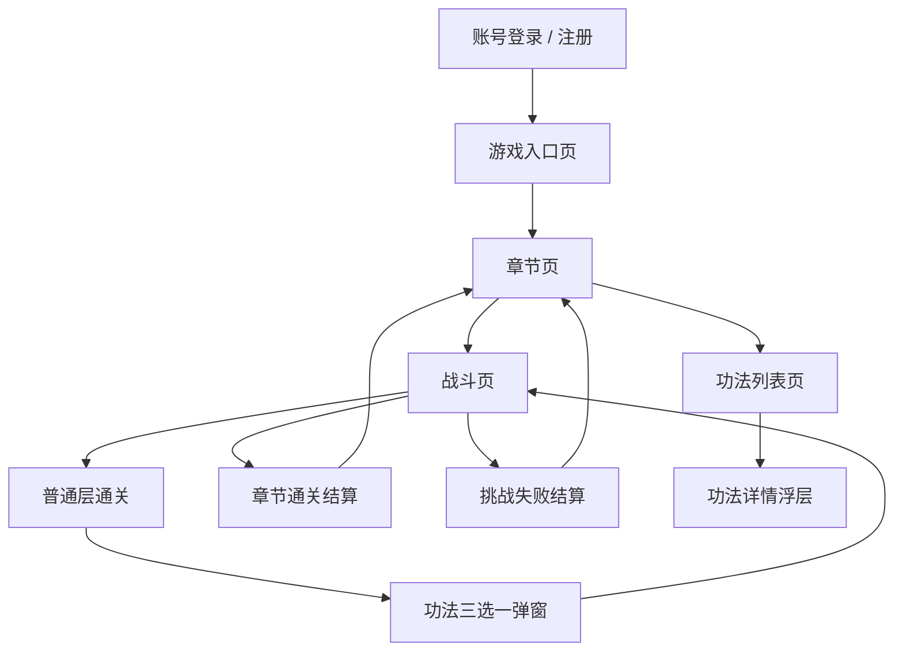

# V0 信息架构

## 页面职责

- `游戏入口页`：承接账号登录后的第一个正式游戏界面
- `章节页`：展示当前章节、章节名、章节图和开始入口
- `战斗页`：承载层波、角色状态、敌人状态和实时战斗信息
- `功法三选一弹窗`：每层结束后的核心策略节点
- `功法列表页`：查看已解锁功法与局外升级信息
- `功法详情浮层`：查看功法品质、流派、门派和升级收益
- `结算页`：展示挑战结果与下一步操作

## 核心交互路径

1. 玩家完成账号登录后进入游戏入口页。
2. 点击开始后进入章节页。
3. 从章节页进入当前可挑战章节。
4. 在战斗页自动推进层波。
5. 普通层胜利后弹出三选一。
6. 章节通关或失败后回到章节页。
7. 玩家可从底部页签进入功法页查看功法详情。
